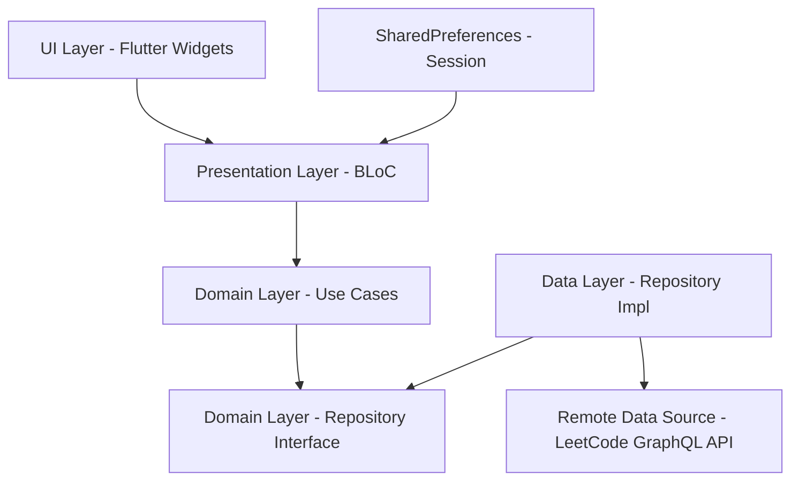

# Ken - LeetCode Progress Tracker & Analytics 🚀

[](https://play.google.com/store/apps/details?id=com.devrachit.ken&hl=en_IN)
[](https://flutter.dev)
[](https://dart.dev)
[](https://blog.cleancoder.com/uncle-bob/2012/08/13/the-clean-architecture.html)
[](https://bloclibrary.dev)
[](https://flutter.dev/multi-platform)

<div align="center">

[](https://play.google.com/store/apps/details?id=com.devrachit.ken&hl=en_IN)

</div>

A comprehensive cross-platform application built with **Flutter** and **Clean Architecture** that
helps developers track their LeetCode progress, compare with others, and visualize their coding
journey through beautiful analytics and interactive charts.

## ✨ Features

### 📊 Dashboard & Analytics

- **Question Progress Tracking**: Visual representation of solved problems categorized by
  difficulty (Easy, Medium, Hard)
- **Activity Heatmap**: GitHub-style contribution calendar showing daily coding activity
- **Contest Performance**: Rating history and participation analytics
- **Streak Tracking**: Current solving streak and total active days
- **Recent Submissions**: Timeline of latest problem solutions
- **Badges Collection**: Display of earned LeetCode achievements

### 📋 Questions Browser

- **Problem Catalog**: Browse the full LeetCode question library with pagination
- **Search & Filter**: Find questions by title, difficulty, and status
- **Question Details**: View problem descriptions, constraints, and metadata
- **Infinite Scroll**: Load more questions seamlessly as you scroll

### 👥 User Comparison

- **Side-by-Side Comparison**: Compare progress between any two users
- **Detailed Analytics**: Progress graphs for each difficulty level
- **Activity Comparison**: Visual comparison of coding activity patterns
- **Contest Performance**: Compare rating progression and contest participation
- **Interactive Charts**: Beautiful FL Chart visualizations

### 📅 Calendar & POTD

- **Daily Challenge Calendar**: Month-view grid of past and upcoming daily challenges
- **Problem of the Day**: Today's featured challenge with quick navigation to details
- **Submission History**: Track daily solve activity on the calendar

### 🏆 Contests

- **All Contests**: Browse the complete LeetCode contest history
- **Upcoming Contests**: View and open registration links for future contests
- **Contest Details**: Start times, durations, and direct links to LeetCode

### 🔐 Authentication & User Management

- **Simple Authentication**: Easy sign-in with your LeetCode username
- **Session Persistence**: Username stored locally via SharedPreferences
- **Logout Support**: Clear session and switch accounts anytime

### 🎨 Modern UI/UX

- **Material Design 3**: Latest design system implementation
- **Dark Theme**: Eye-friendly dark mode interface
- **Smooth Animations**: Fluid transitions and micro-interactions
- **Pull-to-Refresh**: Intuitive data refresh mechanism
- **Advanced Drawer**: Slide-out navigation with animated menu
- **Responsive Design**: Optimized for phones, tablets, and desktop

## 📱 Screenshots & Videos

### App Screenshots


## 🏗️ Project Structure

```
ken/
├── lib/                        # Application source
├── android/                    # Android embedder
├── ios/                        # iOS embedder
├── web/                        # Web embedder
├── macos/                      # macOS embedder
├── linux/                      # Linux embedder
├── windows/                    # Windows embedder
├── assets/                     # App icon & images
├── test/                       # Widget tests
└── pubspec.yaml                # Dependencies & Flutter config
```

```
lib/
├── main.dart                           # Entry point, RepositoryProvider & BlocProvider setup
├── app/
│   └── app.dart                        # MaterialApp, drawer shell, bottom navigation
├── core/
│   ├── network/
│   │   ├── dio_client.dart             # HTTP client (Dio)
│   │   └── graphql_queries.dart        # LeetCode GraphQL queries
│   ├── theme/
│   │   └── app_theme.dart              # Colors & theme constants
│   └── utils/
│       └── constants.dart              # App constants & preference keys
├── data/
│   ├── datasources/
│   │   └── remote/
│   │       └── leetcode_remote_datasource.dart
│   ├── models/                         # JSON serializable API models
│   │   ├── user_model.dart
│   │   ├── user_stats_model.dart
│   │   ├── calendar_model.dart
│   │   ├── contest_model.dart
│   │   ├── contest_list_model.dart
│   │   ├── badges_model.dart
│   │   ├── submission_model.dart
│   │   ├── daily_challenge_model.dart
│   │   └── question_model.dart
│   └── repositories/
│       └── leetcode_repository_impl.dart
├── domain/
│   ├── repositories/
│   │   └── leetcode_repository.dart    # Repository interface
│   └── usecases/                       # Business logic use cases
│       ├── fetch_user_profile_usecase.dart
│       ├── fetch_user_stats_usecase.dart
│       ├── fetch_calendar_usecase.dart
│       ├── fetch_contest_rating_usecase.dart
│       ├── fetch_badges_usecase.dart
│       ├── fetch_recent_submissions_usecase.dart
│       ├── fetch_daily_challenge_usecase.dart
│       ├── fetch_questions_usecase.dart
│       ├── search_questions_usecase.dart
│       ├── fetch_all_contests_usecase.dart
│       └── fetch_upcoming_contests_usecase.dart
└── presentation/
    ├── blocs/                          # State management (BLoC)
    │   ├── auth/                       # Authentication
    │   ├── home/                       # Dashboard data
    │   ├── questions/                  # Question catalog
    │   ├── question_details/           # Single question view
    │   ├── compare/                    # User comparison
    │   ├── calendar/                   # POTD & calendar
    │   ├── contests/                   # Contest listings
    │   ├── settings/                   # App settings
    │   └── user_details/               # User profile view
    ├── screens/
    │   ├── auth/login_screen.dart
    │   ├── home/home_screen.dart
    │   ├── questions/questions_screen.dart
    │   ├── question_details/question_details_screen.dart
    │   ├── compare/
    │   │   ├── compare_users_screen.dart
    │   │   └── compare_screen.dart
    │   ├── calendar/calendar_screen.dart
    │   ├── contests/contests_screen.dart
    │   ├── settings/settings_screen.dart
    │   └── user_details/user_details_screen.dart
    └── widgets/                        # Reusable UI components
        ├── app_drawer.dart
        ├── home_header.dart
        ├── question_progress_widget.dart
        ├── calendar_heatmap_card.dart
        ├── contest_rating_card.dart
        ├── recent_submissions_card.dart
        ├── badge_display.dart
        ├── question_list_tile.dart
        ├── questions_filter_modal.dart
        ├── difficulty_chip.dart
        ├── shimmer_widgets.dart
        └── calendar/
            ├── calendar_grid.dart
            └── problem_of_the_day_card.dart
```

## 🔄 Data Flow Architecture

The app follows **Clean Architecture** principles with clear separation of concerns:



### Data Flow Details:

1. **UI Layer (Presentation)**
   - Flutter widgets and screens
   - State management with BLoC (`BlocProvider`, `BlocBuilder`)
   - Navigation via `MaterialApp`, drawer, and bottom navigation bar

2. **Domain Layer**
   - Business logic encapsulated in use cases
   - Repository interfaces defining data contracts
   - Domain-agnostic, framework-independent logic

3. **Data Layer**
   - Repository implementations coordinating remote calls
   - LeetCode GraphQL API access via Dio
   - JSON serializable models for API responses

4. **Session Layer**
   - SharedPreferences for persisting authenticated username
   - Auth BLoC reads/writes session on login and logout

## 🛠️ Tech Stack

### Core Technologies

- **Framework**: Flutter
- **Language**: Dart
- **Architecture**: Clean Architecture + BLoC
- **Dependency Injection**: `RepositoryProvider` / `BlocProvider`
- **Navigation**: MaterialApp with drawer & bottom navigation

### Data & Networking

- **HTTP Client**: Dio
- **API**: LeetCode GraphQL
- **JSON Parsing**: JSON Serializable + build_runner
- **Session Storage**: SharedPreferences

### UI & Design

- **Material Design**: Material 3 dark theme
- **Charts**: FL Chart
- **Calendar**: Flutter Heatmap Calendar
- **Animations**: Flutter Advanced Drawer
- **Shimmer Effects**: Shimmer
- **Image Loading**: Cached Network Image
- **HTML Rendering**: Flutter HTML
- **Typography**: Google Fonts

### Development Tools

- **Build System**: Flutter CLI + pub
- **Code Generation**: build_runner, json_serializable
- **Code Quality**: flutter_lints
- **App Icons**: flutter_launcher_icons
- **Version Control**: Git

## 🎯 Features in Detail

### Dashboard Analytics

- **Progress Visualization**: Segmented progress indicators showing solved problems by difficulty
- **Streak Tracking**: Current solving streak with historical heatmap data
- **Activity Heatmap**: Year-view contribution calendar on the home screen
- **Contest Analysis**: Rating progression and participation metrics
- **Recent Activity**: Latest accepted submissions timeline

### Questions Browser

- **Full Catalog**: Paginated list of LeetCode problems with difficulty chips
- **Search**: Real-time question search by title
- **Filters**: Filter modal for difficulty and solve status
- **Question Details**: Full problem view with HTML-rendered descriptions

### User Comparison

- **Multi-User Analysis**: Compare any two LeetCode profiles side by side
- **Progress Comparison**: Difficulty-wise solved counts and acceptance rates
- **Activity Analysis**: Compare coding patterns and streaks
- **Visual Charts**: Interactive FL Chart comparison graphs

### Calendar & Contests

- **POTD Calendar**: Monthly grid highlighting daily challenge completion
- **Today's Challenge**: Featured problem card with navigation to details
- **Contest Browser**: Tabbed view of all past and upcoming LeetCode contests
- **Direct Links**: Open contest pages on LeetCode via url_launcher

## 🔧 Configuration

### API Configuration

The app uses LeetCode's GraphQL API via Dio. No additional API keys required.

## 📞 Support

- **Play Store**: [Download Ken on Play Store](https://play.google.com/store/apps/details?id=com.devrachit.ken&hl=en_IN)
- **GitHub**: [dauntlessdaksh/ken](https://github.com/dauntlessdaksh/ken)
- **Issues**: Create an issue for bug reports or feature requests

## 🎉 Acknowledgments

- LeetCode for providing the GraphQL API
- Flutter team for the cross-platform framework
- BLoC library for predictable state management
- Open source community for amazing packages (FL Chart, Dio, Shimmer, and more)

---

Made with ❤️ by Rachit Daksh

<div align="center">

[](https://play.google.com/store/apps/details?id=com.devrachit.ken&hl=en_IN)

</div>
